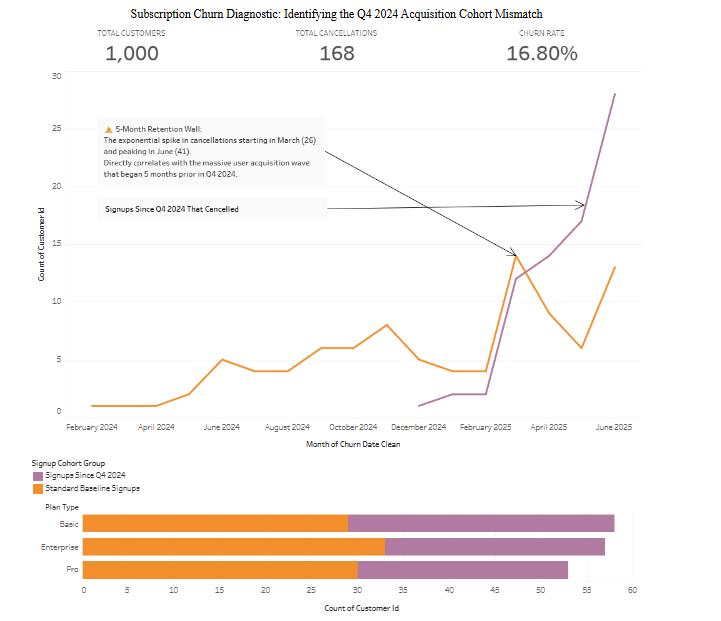

# SaaS-Churn-Diagnostic-Audit
End-to-end SaaS churn audit. Used MySQL to clean dates and build cohort metrics. Deployed a Tableau dashboard to isolate a critical 5-month retention cliff likely due to a marketing ICP targeting mismatch starting Q4 2024.

## Executive Summary
Conducted an end-to-end business intelligence audit for a SaaS platform (n=1,000) to diagnose an exponential surge in customer attrition between Q4 2024 and Q2 2025. By engineering a structured data pipeline in SQL and deploying an interactive Tableau dashboard, I successfully isolated a critical 5-month retention cliff driven entirely by a top-of-funnel acquisition mismatch.

## Project Links
* **Interactive Dashboard:** [https://public.tableau.com/app/profile/samuel.foga/viz/SaaS-UnderstandingChurn-Project1/SaaSSubscriptionChurnDiagnosticAudit]

## Repository Structure
* [saas_etl_and_data_cleaning.sql](saas_etl_and_data_cleaning.sql): SQL script initializing the schema, staging tables, and standardizing messy date strings.
* [saas_churn_root_cause_analysis.sql](saas_churn_root_cause_analysis.sql): Advanced analysis queries utilizing CTEs, aggregations, and tenure calculations to isolate the core insights.

## Technical Architecture & Methodology
* **Data Engineering & ETL (SQL):** Constructed a staging environment in MySQL Workbench. Engineered sanitization scripts utilizing `CONCAT()` and `STR_TO_DATE()` to transform inconsistent text attributes into uniform database `DATE` types.
* **Cohort Analysis:** Developed optimized Common Table Expressions (CTEs) and subqueries to calculate macro retention metrics. Validated data stability by cross-referencing month-over-month signup distributions.
* **Root Cause Analysis (RCA):** Identified that monthly churn surged from a baseline of 6–8 cancellations to a peak of 41 in June. Mathematically proved via `DATEDIFF` calculations that departing users possessed a tenure of exactly 5 months, mapping the issue back to the Q4 2024 registration wave.

## Core Competencies Demonstrated
* Relational Database Design & ETL
* Advanced SQL (CTEs, Subqueries, Date Functions)
* Business Intelligence (Tableau)
* Root Cause Analysis (RCA)

